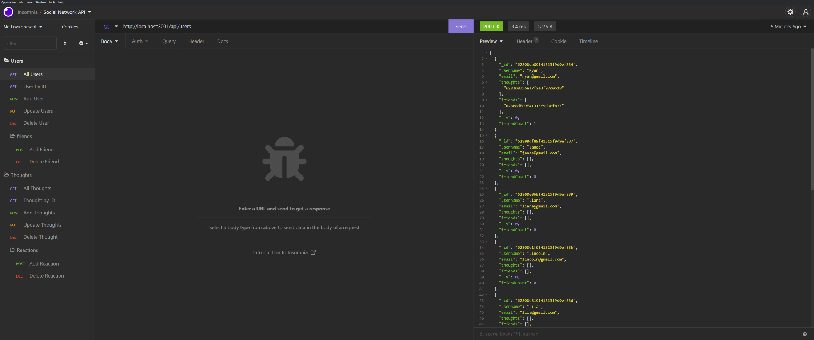

# Social-Network-API

## License

## Table of Contents
- [Project Description](#project-description)  
- [Installation Information](#installation-information)  
- [Usage Information](#usage-information)  
- [Test Instructions](#test-instructions)  
- [Contributors on this Project](#contributors-on-this-project)  
- [Contact Information](#contact-information)  
  
## Project Description
- This Repo is a noSQL database using MongoDB. It allows the API endpoints to interact with the database. This database is designed for a social networking platform. The database contains API endpoints for Users, their thoughts or comments, and their friend's reactions to those thoughts.
  
## Installation Information
- Fork the repo 
- Run NPM Install 
- Start the server by entering NPM start
  
## Usage Information
- Here is a Link to the Demo Video. https://youtu.be/fyQNy0CoR2M

 

- 

## Contributors on this Project
- None
- *[Contribution Guidlines](https://github.com/github/docs/blob/main/CONTRIBUTING.md)*
  
## Test Instructions
- Use Insomnia to view ar add data to the DB.

## Questions

- If you have any questions about the repo, open an issue or contact me on Github or by Email.
### Contact Information
- Github [RHoward1](https://github.com/RHoward1)
  - Email at ryanmhoward.dev@gmail.com

## License Statement
- This application is covered by the  license.
- Visit [MIT](https://opensource.org/licenses/MIT) for more information.
